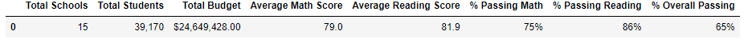

# Module 4 Challenge - (School_District_Analysis)
## Objective
Our task was to take test data from several types of schools and prepare an evaluation of their performance.
We were originally given one set of data, however there was some concern that there may have been some fraudulent scores submitted for evaluation.
Our task then became to analyze the schools with both data sets to see if there were any clear evidence of fraud.

## Analysis
Utilizing Python, we downloaded the data an ran two rounds of analysis.  First, all schools and grades were included.  Then, we were asked to remove
the 9th grade scores from Thomas High School (THS), as this was the source of the suspected foul play.

### Scores by District
The original scores by district were: 

while the revised scores by district were:

The removal of the THS students seemed to have a minimal effect on the average test scores and the overall percentage of passing students.

### Scores by School

The original score by school were:

while the revised were:

While the overall scores for the district were not significantly effected, there was a large drop in the number of students passing math, reading, and overall in THS.
The overall average scores for both tests did not change by much, however, which seems to indicate that there is a large group of underperfoming students at THS.

### Scores by Spend

In reviewing the original scores by spend:

and the scores by spend for the revised data:

there are no significant changes in the data.

### Other factors

The data also did not show significant differences when reviewing by school type or size.

In conclusion, there does seem to be a fairly signicant group of lower performing students at THS.  Further investigation would have to be performed to determined
whether test scores were changed or not.
